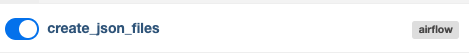
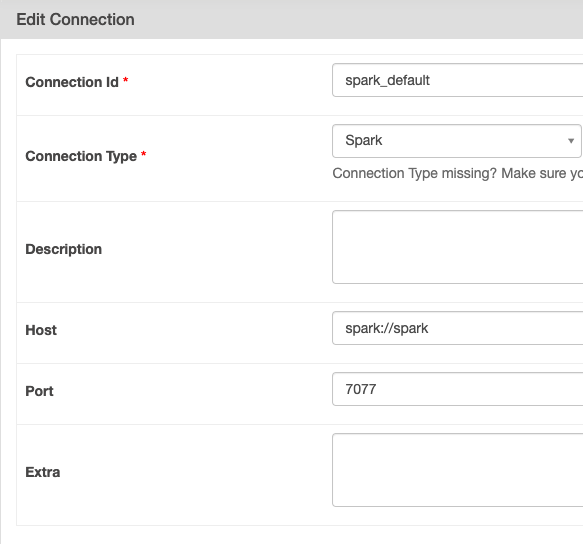

<h1>Capstone project</h1>
<h2>Description generate_registers_dag.py</h2>
  

  
<ul>
  <li>Creates .json files with 100 registers each</li>
  <li>The number of .json files depends on the filesToGenerate airflow variable</li>
  <li>The date of the folders where the files are created depends on the start_Date airflow variable</li>
</ul>  
  

<h2>Description subscription_parquet_job.py</h2>
  

  
<ul>
  <li>Create a parquet file with the information of the 10 different types of subscriptions</li>
</ul>  
  

<h2>Description jobs_dag.py</h2>
  

  
<ul>
  <li>Creates snapshots based on the information of the .json files</li>
  <li>Saves the information in parquet files</li>
  <li>If there is no previous snapshot it will execute all the journal data</li>
  <li>If there is a current snapshot it will build on top of that. A snapshot does not contain duplicate keys, this means that if an existing key is found in more recent journal data then the old one will be replaced.</li>
  <li>A snapshot does not delete old keys.</li>
  <li>The enrichment is performed with a join.</li>
  <li>A snapshot does not delete old keys.</li>
</ul>  
<h2>Functions</h2>
  
<ul>
  <li>getMaxDateSnapshots: Get the date of the most recent snapshot</li>
  <li>readMaxDateSnapshoots: Retrieves the most recent snapshot information</li>
  <li>getSubscriptions: Retrieve subscription information from a parquet file</li>
  <li>getMaxDateRegisters: Get the date of the most recent .json file with registers</li>
  <li>enrichNewRegisters: Enriches records whose date is newer than the most recent snapshot</li>
  <li>joinData: Performs the join between the new enriched records and the most recent snapshot information</li>
  <li>createNewSnapshot: Creates the new snapshot base in the new enriched records and the past snapshot</li>
</ul>  
  

<h1>How to run</h1>
<h2>Create new images</h2>

docker build -f Dockerfile.Spark . -t spark-air

docker build -f Dockerfile.Airflow . -t airflow-spark

  

<h2>Docker commands</h2>
  
<ul>
  <li>docker-compose up airflow-init</li>
  <li>docker-compose up -d</li>
</ul>  
  

<h1>Connection to spark</h1>
  

  
